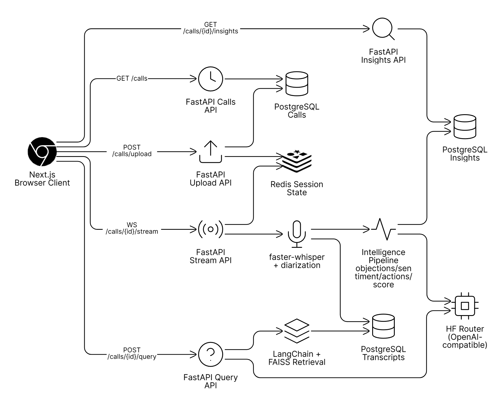

# SalesLens - Real-Time Sales Call Intelligence

SalesLens is a intelligence platform for sales calls. Upload a call, stream transcription in real time, generate actionable insights, and ask grounded questions over the transcript.

## Demo

- Screenshot/GIF placeholder: add `docs/demo.gif` after local run validation.

## Architecture



## Core Features

1. Audio upload (`.mp3`/`.wav`) with call session creation.
2. Real-time transcript streaming over WebSocket.
3. Post-call intelligence:
   - objection detection
   - sentiment timeline
   - action item extraction
   - call score (0-100) with reasoning
4. RAG-powered Q&A over transcript chunks with timestamp citations.
5. History page for previously analyzed calls.

## API Endpoints

- `POST /calls/upload` -> returns `{ call_id, status }`
- `WS /calls/{id}/stream` -> emits `transcript_segment` events and completion state
- `GET /calls/{id}/insights` -> returns objections/action items/sentiment/call score
- `POST /calls/{id}/query` -> body `{ question }`, returns grounded answer
- `GET /calls` -> list all calls

## Tech Stack

- Backend: Python, FastAPI, Redis, PostgreSQL
- STT: faster-whisper (streamed events)
- RAG: LangChain + FAISS
- LLM provider: Hugging Face Router via OpenAI-compatible SDK
- Frontend: Next.js + React + Tailwind-style global design system
- Package managers: `uv` (Python), `pnpm` (JS)
- Deployment: Render (backend), Vercel (frontend)

## Local Setup

### 1) Infrastructure

```bash
docker compose -f infra/docker-compose.yml up -d
```

### 2) Backend

```bash
cd backend
cp .env.example .env
uv sync
uv run alembic upgrade head
uv run uvicorn app.main:app --reload --port 8000
```

### 3) Frontend

```bash
cd frontend
pnpm install
pnpm dev
```

Set `NEXT_PUBLIC_API_URL=http://localhost:8000`.

## Deployment

- Backend: use `infra/render.yaml`, configure env vars (`DATABASE_URL`, `REDIS_URL`, `HF_TOKEN`).
- Frontend: deploy `frontend/` on Vercel and set `NEXT_PUBLIC_API_URL` to backend URL.

## How this maps to real-world sales intelligence

- **Rep coaching:** talk/listen ratio and objection heatpoints identify coaching opportunities.
- **Pipeline hygiene:** action item extraction captures follow-up commitments automatically.
- **Revenue risk visibility:** objection detection and sentiment trend reveal deal friction early.
- **Enablement search:** RAG Q&A makes long calls instantly searchable for managers and reps.
